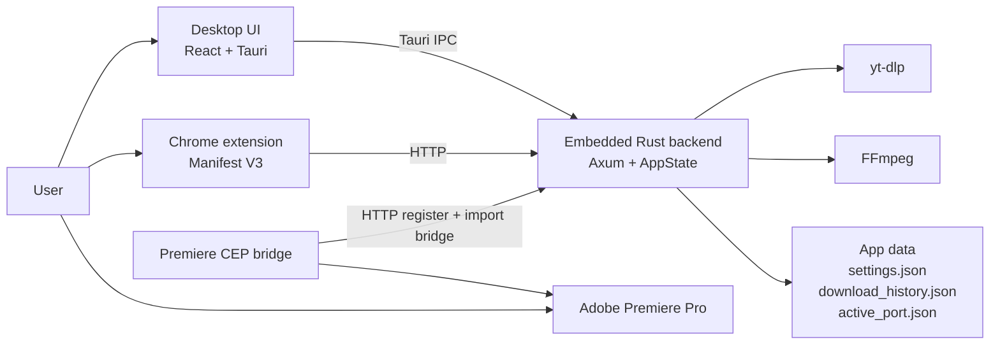
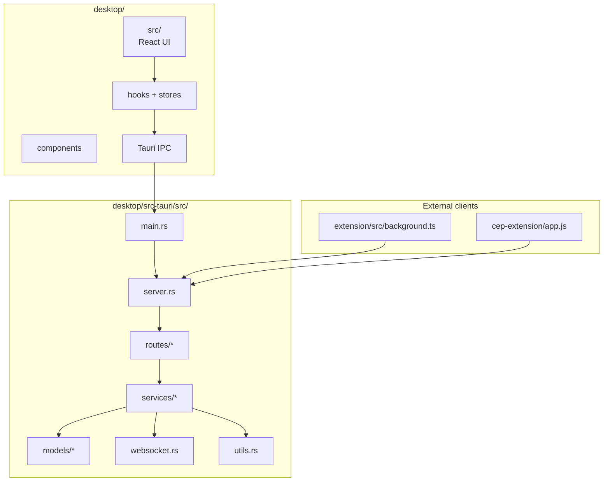
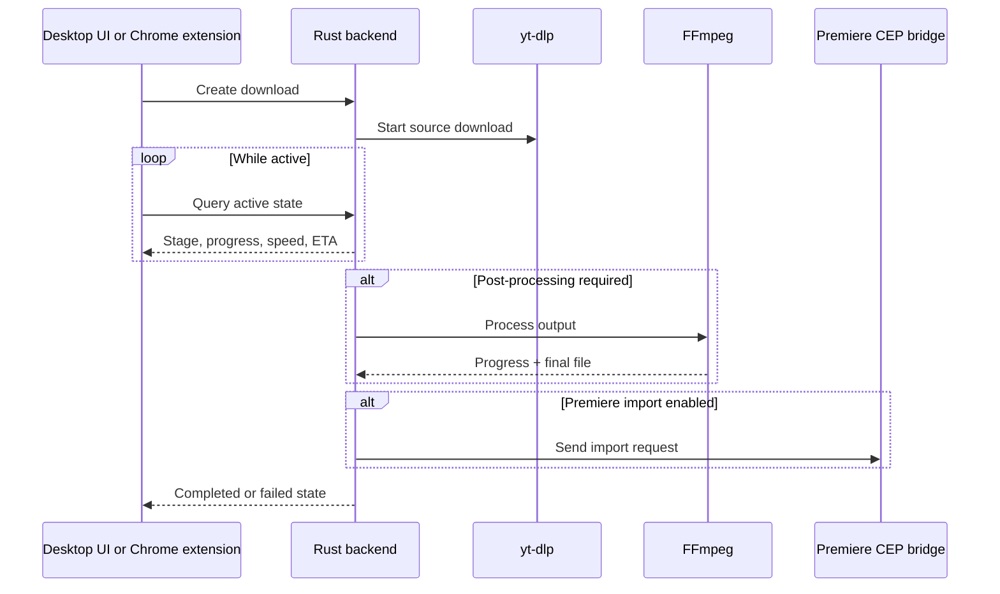

# Architecture

## Overview

YT2Premiere is a desktop-first application. The desktop app embeds the Rust backend, and the browser extension plus the Premiere bridge talk to that same local runtime.

The desktop UI uses Tauri IPC. The Chrome extension uses HTTP polling. Premiere integration is handled through a local CEP bridge.

## System context

## Runtime model

### Desktop app

- `desktop/src/` contains the React UI
- `desktop/src-tauri/` contains the Rust runtime
- the app stays alive in the tray when the window is closed
- `--background` starts the backend without showing the main window
- a single-instance guard prevents multiple desktop app instances from competing

### Backend

- the backend binds the first free loopback port in `3001-3010`
- the selected port is persisted in `active_port.json`
- the backend owns download state, settings, history, subprocess lifecycle, and Premiere registration
- `yt-dlp` handles remote extraction and download
- `FFmpeg` handles clip/export/post-processing

### Chrome extension

- the extension discovers the local backend by probing the health endpoint
- downloads are created over HTTP
- progress is tracked by polling `/active-downloads`
- the extension never owns the authoritative queue state

### Premiere bridge

- the CEP panel exposes a local bridge inside Premiere
- the panel registers itself with the backend using `/register-cep`
- when Premiere import is enabled, the backend sends ExtendScript instructions to the CEP bridge

## High-level module map

## Download lifecycle

## State and persistence

- `settings.json` stores user preferences
- `download_history.json` stores completed, failed, and interrupted history entries
- `active_port.json` stores the active local port and backend fingerprint
- in-memory active download state lives in `AppState`
- child subprocess handles are tracked so they can be terminated on shutdown

## Communication

| Source | Target | Transport | Purpose |
| --- | --- | --- | --- |
| Desktop UI | Rust backend | Tauri IPC | local desktop commands |
| Desktop UI | Rust backend | WebSocket | live desktop updates |
| Chrome extension | Rust backend | HTTP | create downloads and poll progress |
| CEP bridge | Rust backend | HTTP | registration and import bridge |
| Rust backend | `yt-dlp` / `FFmpeg` | subprocess | download and post-processing |

## Design principles

- Desktop app is the source of truth for queue and history
- External clients are thin and disposable
- Download execution is isolated in subprocesses
- The backend remains available even when the main window is hidden
- Premiere integration is optional and must not block core downloads
