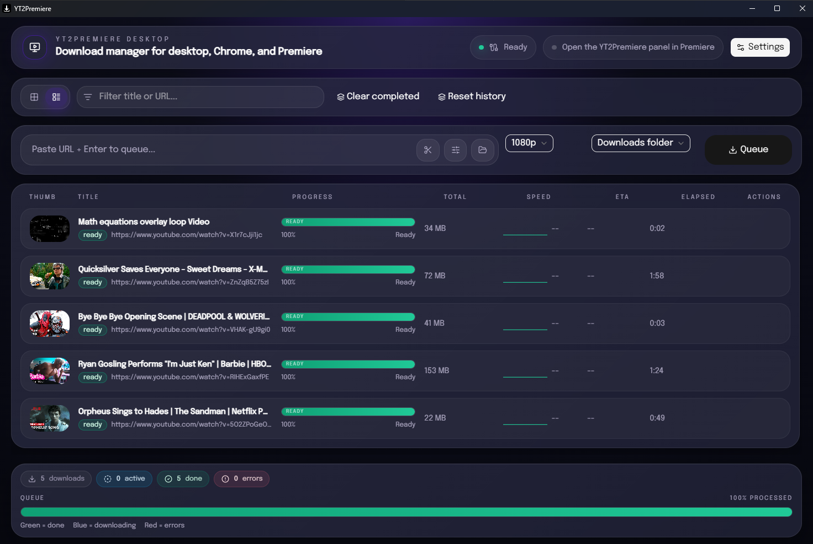
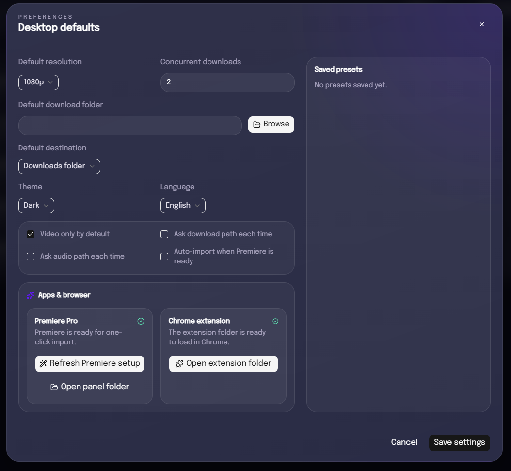
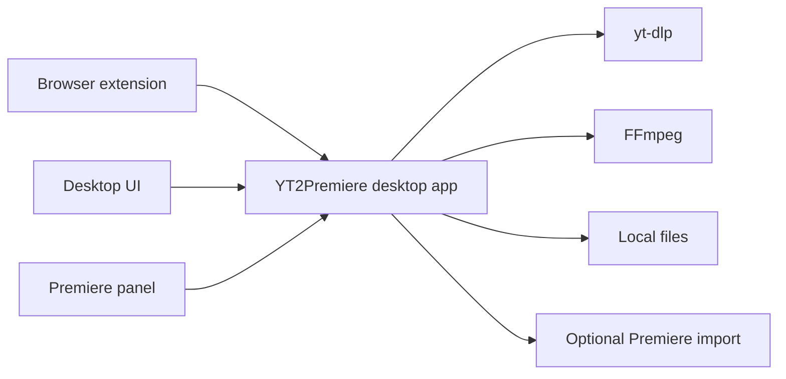

# YT2Premiere

Open-source video downloader with a desktop app, browser extensions for Chrome and Firefox, and optional Adobe Premiere Pro import.

YT2Premiere gives you one local queue for downloads, clips, audio exports, and Premiere handoff. Use it as a standalone desktop downloader, queue jobs directly from Chrome or Firefox, or send finished media into Premiere when you need it.

Use it with or without Premiere Pro.

## Screenshots

### Desktop queue



### Chrome controls and desktop settings

<p align="left">
  
  
</p>

## Why YT2Premiere

- Use it as a standalone downloader or from Chrome or Firefox
- Queue downloads directly from the browser while browsing
- Download video, audio, or clips from `yt-dlp` supported sites
- Manage everything in one desktop queue with history, retry, and progress tracking
- Avoid copy-pasting URLs into a downloader for every job
- Export only the exact clip you need instead of storing the full source file
- Optionally auto-import finished files into Adobe Premiere Pro
- Keep the desktop app running in the background while the browser and Premiere talk to the same local app

## Common Workflows

### Standalone desktop

1. Paste a URL into the desktop app.
2. Choose full video, audio, or an exact clip range.
3. Download only what you need.
4. Open the file locally or keep it ready for editing later.

### Browser to desktop

1. Browse in Chrome or Firefox.
2. Queue a video, audio export, or clip from the page.
3. Follow progress in the desktop app.
4. Open the file locally or send it to Premiere.

## What You Can Do

| Task | Supported |
| --- | --- |
| Download full videos | Yes |
| Download audio-only exports | Yes |
| Export short clips | Yes |
| Trigger downloads from Chrome or Firefox | Yes |
| Track progress in the desktop app | Yes |
| Import into Premiere Pro | Optional |
| Use the app without Premiere Pro | Yes |

## Desktop And Browser

YT2Premiere works well in both modes:

- use the desktop app when you already have a URL and want a clean local queue
- use the browser extension when you want to grab media without leaving the page
- send full videos, audio, or clips to the same desktop queue
- keep the heavy work in the desktop app instead of the browser
- optionally hand finished media off to Premiere

One of the most useful workflows is clipping only the exact section you need, which keeps your library smaller and avoids downloading more than necessary.

## How It Works



The desktop app is the source of truth. The browser extension and Premiere are lightweight clients around the same local queue.

## Install

### Desktop app

1. Download the latest Windows installer from Releases.
2. Prefer the `-setup.exe` installer for the default Windows install flow, or use the `.msi` if you need the Windows Installer package format.
3. Launch `YT2Premiere`.

### Chrome extension

1. Download and extract `YT2Premiere-chrome-extension.zip`.
2. Open `chrome://extensions`.
3. Turn on `Developer mode`.
4. Click `Load unpacked`.
5. Select the extracted extension folder.

### Firefox extension

From a release:

1. Download and extract `YT2Premiere-firefox-extension.zip`.
2. Launch `YT2Premiere` desktop so the local bridge is running.
3. Open Firefox and go to `about:debugging#/runtime/this-firefox`.
4. Click `Load Temporary Add-on...`.
5. Select the extracted `manifest.json`.
6. Open YouTube and use the YT2Premiere controls from the player.

From source:

1. Run `cd extension && npm run build:firefox`.
2. Open Firefox and go to `about:debugging#/runtime/this-firefox`.
3. Click `Load Temporary Add-on...`.
4. Select `extension/dist-firefox/manifest.json`.

Firefox still requires AMO signing for permanent installation in standard builds. The release zip is intended for local testing and signing workflows.

### Premiere panel

1. Download and extract `YT2Premiere-cep-extension.zip`.
2. Copy it to `%APPDATA%\\Adobe\\CEP\\extensions\\com.yt2premiere.cep`.
3. Open Premiere Pro.
4. Open `Window > Extensions (Legacy) > YT2Premiere`.

## Quick Start

1. Launch `YT2Premiere`.
2. Paste a supported media URL into the desktop app or trigger a download from the browser extension.
3. Choose the output you want: full video, audio, or clip.
4. Start the queue.
5. Open the finished file locally, or let YT2Premiere add it to Premiere if import is enabled.

## Core Features

- Desktop-first queue manager built with Tauri, Rust, and React
- Download history with retry support
- Concurrent download control
- Resolution, codec, audio, and clip options
- FFmpeg-based finishing and exports
- Browser extension for one-click queueing from Chrome and Firefox
- Premiere Pro bridge for import workflows
- Single-instance desktop runtime with tray behavior

## Run From Source

### Requirements

- Windows
- Node.js 22
- Rust stable
- Google Chrome or Firefox
- Adobe Premiere Pro only if you want to test Premiere import

### Install dependencies

```bash
cd extension
npm ci

cd ../desktop
npm ci
```

### Start the desktop app

From the repository root:

```bash
npm run dev:desktop
```

### Build the Chrome extension

```bash
cd extension
npm run build
```

### Build the Firefox extension

```bash
cd extension
npm run build:firefox
```

### Test Premiere integration in development

```powershell
powershell -ExecutionPolicy Bypass -File .\scripts\install-cep-dev.ps1
```

Then open:

`Window > Extensions (Legacy) > YT2Premiere`

## Project Layout

- `desktop/` - Tauri desktop app, React UI, Rust backend
- `extension/` - browser extension source and build output
- `cep-extension/` - Premiere CEP panel
- `scripts/` - setup and packaging helpers

## Documentation

- [Architecture](./ARCHITECTURE.md)
- [Contributing](./CONTRIBUTING.md)

## License

This project is licensed under the Mozilla Public License 2.0.

Third-party files and dependencies keep their own licenses where applicable.
